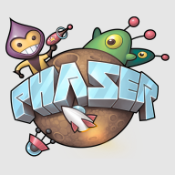

# Custom Phaser / Enable3D Game Boilerplate setup configuration

** Built with Typescript, Webpack, Phaserjs / Enable3D(Threejs, Ammojs) **

Download zip and run npm install.

Custom boilerplate set up for building Phaser games, using many features from a closed source project.

Contains convenient classes like an Ajax manager, preloader, audio cache manager, and login functionality to link to back-end.

